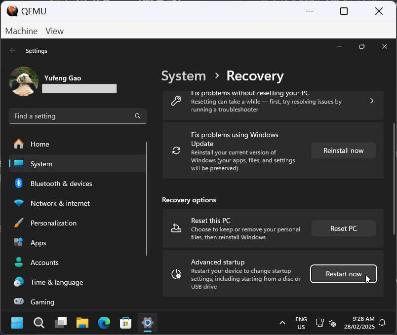
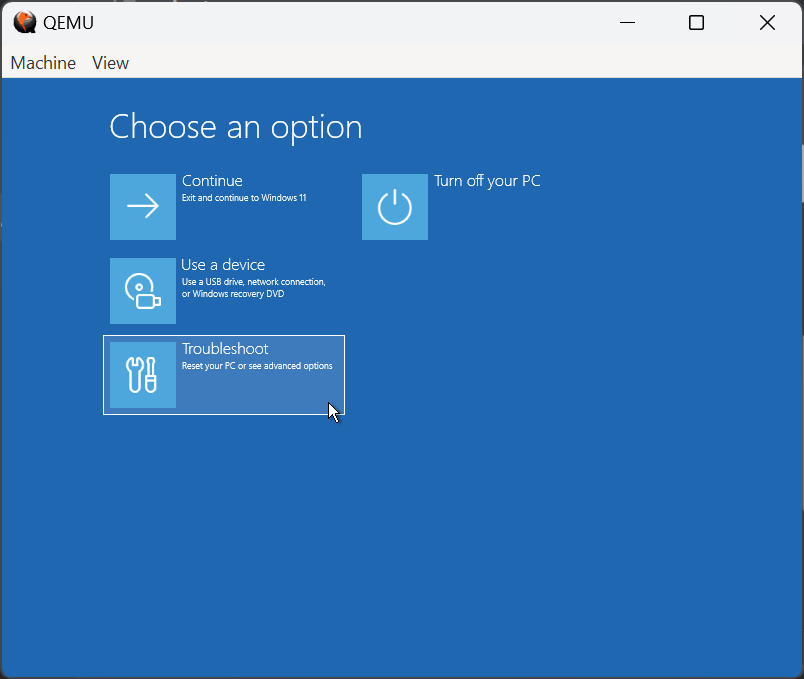
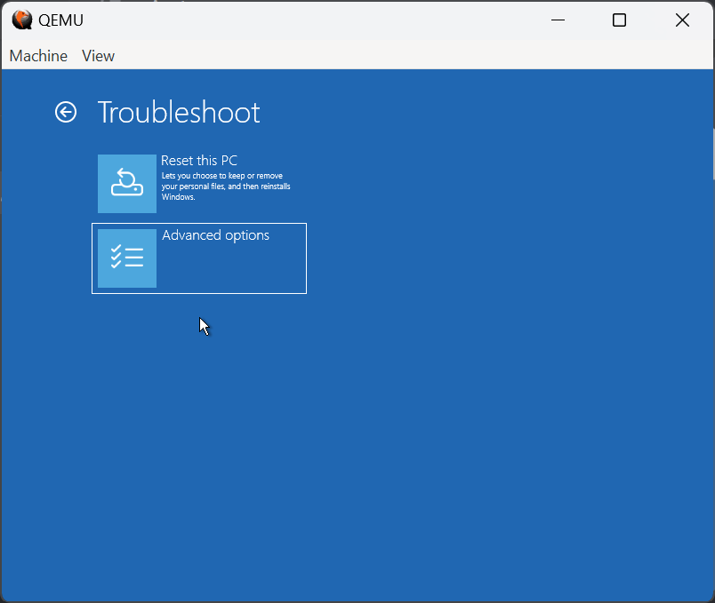
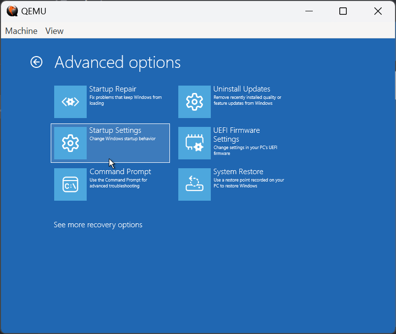
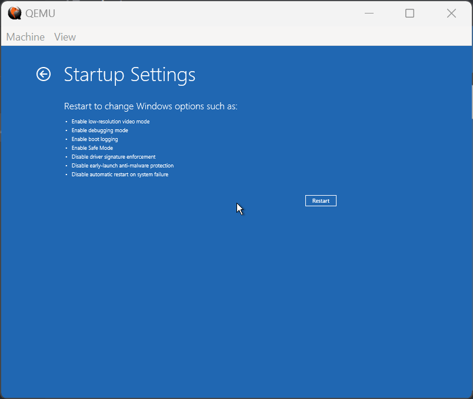
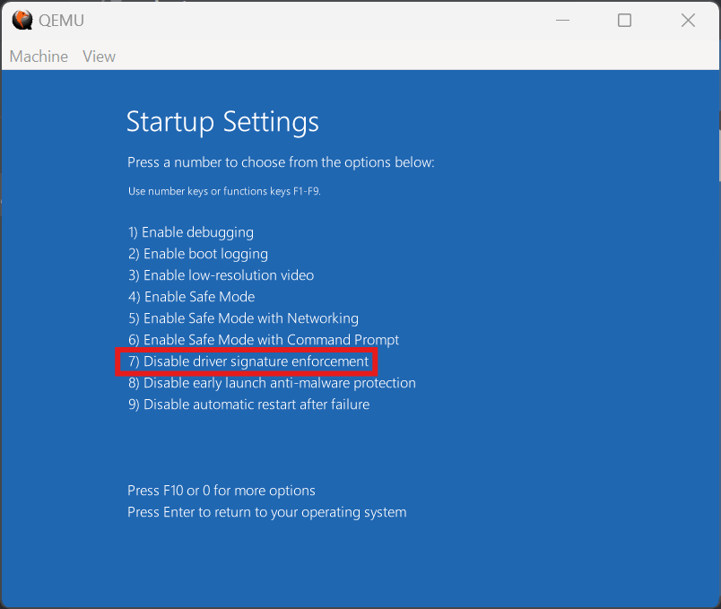
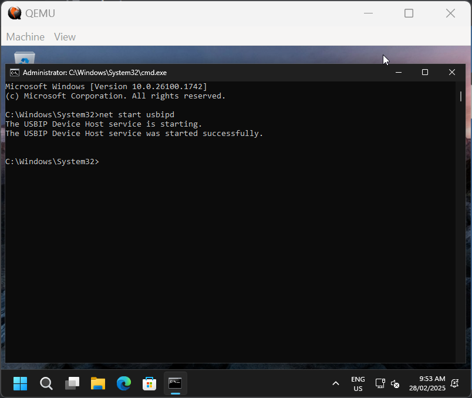
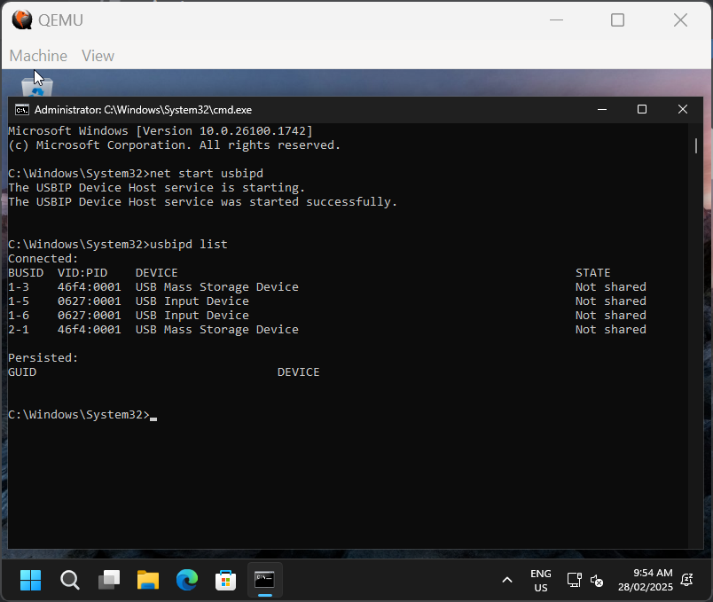

# Running usbipd on ARM64
> [!IMPORTANT]
> This is an unofficial guide for making usbipd work on ARM64 PCs. It is not endorsed nor supported by course staff, and I am not responsible for any damage caused by following this unofficial guide.

> [!IMPORTANT]
> ARM64 support is currently EXTREMELY EXPERIMENTAL. So far, I'm the only person who managed to get it to work, on an emulated ARM64 device which differs considerably from production ARM64 PCs. This has NOT been tested on physical hardware, and may cause damage to your device. I am not responsible for any damage caused, you have been warned!

J-Link requires the J-Link driver for SEGGER, and that driver does not exist for ARM64. For this reason, ARM64 versions of J-Link only supports WinUSB. While the driver exists for x86-64, it cannot be used on ARM64 hardware.

This essentially means that the code flashing can only be done in WSL (by following the official guide). The showstopper for using WSL here is that usbipd is required for USB passthrough, and usbipd relies on the Virtual Box USB and USB Monitor drivers for which production ones do not exist for ARM64.

## Installing usbipd
Install usbipd normally, and it will attempt to install the x86-64 versions of the VirtualBox USB and USB Monitor drivers. The installation will succeed, but the usbipd service will fail to start due to the x86-64 drivers being incompatible.

## Installing Native ARM64 Drivers
The native ARM64 drivers will be installed in order to get the usbipd service to work. Unfortunately, the native drivers are currently still being developed and therefore not properly signed for production use. If you just attempt to install the drivers, Windows will complain about digital signature issues and prevent the drivers from being installed/loaded.

### Disabling Signature Enforcement
We must disable driver signature enforcement to force Windows to accept these drivers. To do this, go to Settings -> System -> Recovery, and under Advanced Startup, click Restart Now.



Afterwards, you will be shown multiple options, select "Troubleshoot":



Then select "Advanced options":



Select "Startup Settings":



Click "Restart":



Finally, on the Startup Settings page, select "Disable driver signature enforcement" by pressing `F7`.



### Installing VirtualBox USB Driver
Download the ARM64 version of the VirtualBox USB driver [here](./software/VBoxUSB.zip). Extract it somewhere, right click on `VBoxUSB.inf` and select "Install". If asked to trust the publisher, do so and continue the installation.

### Installing VirtualBox USB Monitor Driver
Download the ARM64 version of the VirtualBox USB Monitor driver [here](./software/VBoxUSBMon.zip). Extract it somewhere, right click on `VBoxUSBMon.inf` and select "Install". If asked to trust the publisher, do so and continue the installation.

## Starting usbipd Service
Open up Command Prompt or PowerShell as admin, and enter the command `net start usbipd`.



## Testing usbipd
Run `usbipd list` and it should no longer complain about the service not being started. Now follow the official WSL guide to have the rest of the SDK setup.



## Troubleshooting
If anything goes wrong (very high chance of happening), you may have to see me in person (or maybe just give up).

> [!IMPORTANT]
> The following sections are provided for information purposes only, DO NOT try these yourself unless you seriously know what you are doing (i.e., can understand the logic behind every step) or that you are prepared to brick your device. Remember that I am not responsible for any damage caused.

### Manually Installing VBoxUSB Service
1. Copy `VBoxUSB.sys` to `C:\Windows\System32\drivers`.
2. Run `pnputil -i -a VBoxUSB.inf` and note down the OEM INF number.
3. Create the following registry script.
```ini
Windows Registry Editor Version 5.00

[HKEY_LOCAL_MACHINE\SYSTEM\CurrentControlSet\Services\VBoxUSB]
"Type"=dword:00000001
"Start"=dword:00000003
"ErrorControl"=dword:00000001
"Tag"=dword:00000022
"ImagePath"=hex(2):5c,00,53,00,79,00,73,00,74,00,65,00,6d,00,52,00,6f,00,6f,00,\
  74,00,5c,00,53,00,79,00,73,00,74,00,65,00,6d,00,33,00,32,00,5c,00,44,00,72,\
  00,69,00,76,00,65,00,72,00,73,00,5c,00,56,00,42,00,6f,00,78,00,55,00,53,00,\
  42,00,2e,00,73,00,79,00,73,00,00,00
"DisplayName"="@oem6.inf,%VBoxUSB_SvcDesc%;VirtualBox USB Service"
"Group"="Base"
"Owners"=hex(7):6f,00,65,00,6d,00,36,00,2e,00,69,00,6e,00,66,00,00,00,00,00
```
4. Edit the `oem*.inf` in `DisplayName` and `Owners` to match what `pnputil` reported.
5. Merge the registry script.

### Changing VBoxUSBMon Startup Type
1. Open up Registry Editor and go to `Computer\HKEY_LOCAL_MACHINE\SYSTEM\ControlSet001\Services\VBoxUSBMon`.
2. Change `Start` to `3`.

### Manually Starting VBoxUSBMon
1. Open up Command Prompt or PowerShell as admin.
2. Run `net start vboxusbmon`.

### Turning on Test Mode
1. Open up Command Prompt or PowerShell as admin.
2. Run `bcdedit /set testsigning on`.
3. Reboot.
