# Interactive Debugging
> [!IMPORTANT]
> This is an unofficial guide for debugging your code interactively. It is not endorsed nor supported by course staff, and I am not responsible for any damage caused by following this unofficial guide.

> [!NOTE]
> I have only tested this on Windows and WSL (Ubuntu), your mileage may vary on macOS and other Linux distributions.

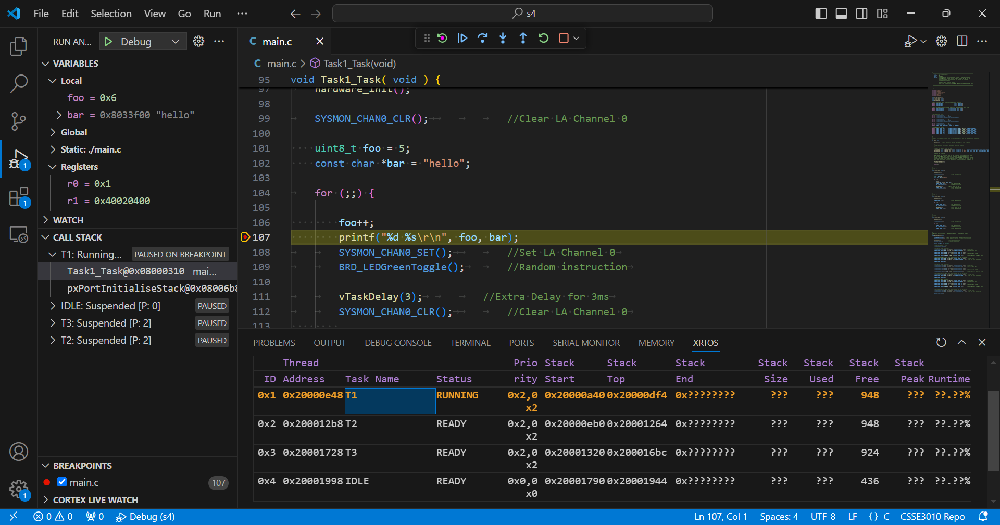

Looks like interactive debugging using VSCode was once supported, but the scripts for generating VSCode config files in `tools/vscode` no longer work. Instead of fixing them which seems like a lot of effort, I'm just going to share my config files.

## Required Software
- Visual Studio Code

> [!NOTE]
> Windows users using my unofficial sourcelib for Windows must do a `git pull` in the `sourcelib` directory, then run the install script again to apply my latest changes. Well, I'm the only one developing on Windows natively, so I guess this note is useless...

## Installing Cortex-Debug Extension
We will be using the Cortex-Debug VSCode extension for debugging. The first thing to do is to install it.

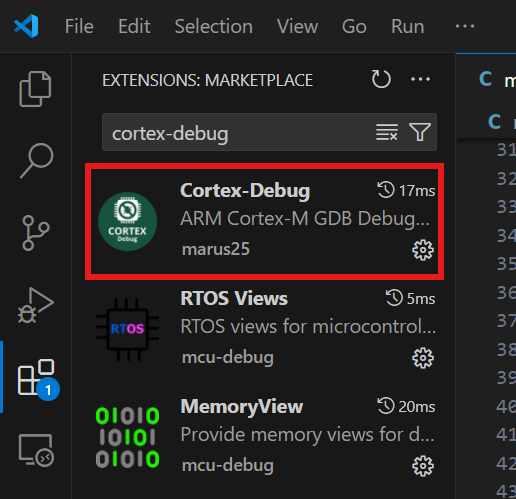

It will also install RTOS Views, MemoryView and Peripheral Viewer automatically, which allows you to see info about FreeRTOS threads, memory content and the states/registers of different peripherals.

## Opening Project Folder
Open VSCode in your project folder. For example, for stage 4, open it in `repo/s4`. You should see a list of files like this:

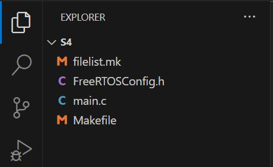

Now, create a new directory called `.vscode` (if it does not exist), and under the `.vscode` directory, create the following files (if they don't already exist):
- `launch.json`
- `settings.json`
- `tasks.json`
- `c_cpp_properties.json` (optional, requires the C/C++ extension)

## Config Files
### Tasks
We need 3 tasks - make, flash and clean, before we can debug our code. Add the following to your `tasks.json`:
```json
{
    "version": "2.0.0",
    "tasks": [
        {
            "label": "make",
            "type": "shell",
            "command": "make"
        },
        {
            "label": "flash",
            "type": "shell",
            "dependsOn": "make",
            "command": "make flash",
            "group": {
                "kind": "build",
                "isDefault": true
            }
        },
        {
            "label": "clean",
            "type": "shell",
            "command": "make clean"
        }
    ]
}
```

The make task simply runs `make`, and the flash task runs the make task first and then runs `make flash`. The default task is flash, so you can automatically build your code and flash it onto the board by pressing `Shift + Ctrl + B`. The clean task can be run manually to run `make clean`.

### Debug Launch
Now we have the tasks setup for building and flashing, we can go a step further to add a debug launch option to flash our code and start an interactive debugging session. We do this by adding the following to `launch.json`:

```json
{
    "configurations": [
        {
            "name": "Debug",
            "cwd": "${workspaceRoot}",
            "executable": "${workspaceRoot}/main.elf",
            "preLaunchTask": "make",
            "request": "launch",
            "type": "cortex-debug",
            "servertype": "jlink",
            "device": "STM32F429ZI",
            "interface": "swd",
            "runToMain": true,
            "rtos": "FreeRTOS",
            "svdFile": "${workspaceRoot}/../../sourcelib/tools/vscode/STM32F429.svd"
        }
    ]
}
```

### Project Settings
If you are on Linux or macOS, doing the above may be enough, however if you are on Windows, you also need to configure some settings. It's also recommended for Linux and macOS users follow this step. Add the following to `settings.json`:

```json
{
    // On Linux, the binaries should be executable from PATH, however if not,
    // try locating them manually. These paths may differ across distributions.
    //
    // "cortex-debug.armToolchainPath.linux": "/usr/bin",
    // "cortex-debug.gdbPath.linux": "/usr/local/bin/arm-none-eabi-gdb",
    // "cortex-debug.JLinkGDBServerPath.linux": "/usr/bin/JLinkGDBServerCLExe",

    // I've never used macOS before, nor am I willing to purchase a Mac to
    // find out ($$$). They should also be on PATH. If not, fill them in.
    //
    // "cortex-debug.armToolchainPath.osx": "_XXX_FILL_THIS_IN_XXX",
    // "cortex-debug.gdbPath.osx": "_XXX_FILL_THIS_IN_XXX",
    // "cortex-debug.JLinkGDBServerPath.osx": "_XXX_FILL_THIS_IN_XXX",

    // For Windows, the paths are dependent on the version of the compiler
    // and JLink software, as well as the Windows architecture. Change them
    // if needed.
    "cortex-debug.armToolchainPath.windows": "C:\\Program Files (x86)\\GNU Arm Embedded Toolchain\\10 2021.10\\bin",
    "cortex-debug.gdbPath.windows": "C:\\Program Files (x86)\\GNU Arm Embedded Toolchain\\10 2021.10\\bin\\arm-none-eabi-gdb.exe",
    "cortex-debug.JLinkGDBServerPath.windows": "C:\\Program Files\\SEGGER\\JLink_V814\\JLinkGDBServerCL.exe",

    "editor.rulers": [79],
    "editor.renderWhitespace": "all",
    "editor.tabSize": 4,
    "editor.insertSpaces": true,

    // Configure the default shell on Windows. This allows us to run POSIX
    // commands like make.
    "terminal.integrated.profiles.windows": {
        "Build Shell": {
            "path": "${workspaceFolder}\\..\\..\\env.bat"
        }
    },
    "terminal.integrated.defaultProfile.windows": "Build Shell"
}
```

You can see that this mostly targets Windows, as the tools are not on the system PATH for Windows and a special environment is needed. The configuration for Linux and macOS are commented out - if Cortex-Debug somehow complains about unable to locate a particular tool, you can try uncommenting the commented out lines and making adjustments to the paths.

### C/C++ Extension
This config is actually not critical, but it's nice to have, so that you get proper syntax highlighting and other features from the LSP. If you already have a `c_cpp_properties.json` and it is working fine, you may skip this step. Here's mine:

```json
{
    "configurations": [
        {
            "name": "CSSE3010 Repo",
            "includePath": [
                "${workspaceFolder}/**",
                "../mylib/**",
                "../../sourcelib/components/boards/nucleo-f429zi/Inc/**",
                "../../sourcelib/components/hal/STM32F4xx_HAL_Driver/Inc/**",
                "../../sourcelib/components/hal/CMSIS/Include/**",
                "../../sourcelib/components/os/FreeRTOS/include/**",
                "../../sourcelib/components/os/FreeRTOS/portable/GCC/ARM_CM4F"
            ],
            "cStandard": "c99",
            "defines": [
                // Define the flag for the microprocessor we're using.
                "STM32F429xx",

                // Windows does not have system compilers and headers, so we
                // must not let the compiler's stdint.h include the system
                // header.
                "__STDC_HOSTED__=0",

                // Define the integer types and ranges given that we're not
                // using the system standard integer header. These may not be
                // correct for the host operating system or the STM32, however
                // it doesn't matter because we're not compiling with these
                // values.
                "__INT8_TYPE__=signed char",
                "__INT16_TYPE__=signed short int",
                "__INT32_TYPE__=signed long int",
                "__INT64_TYPE__=signed long long int",
                "__UINT8_TYPE__=unsigned char",
                "__UINT16_TYPE__=unsigned short int",
                "__UINT32_TYPE__=unsigned long int",
                "__UINT64_TYPE__=unsigned long long int",
                "__INT_LEAST8_TYPE__=signed char",
                "__INT_LEAST16_TYPE__=signed short int",
                "__INT_LEAST32_TYPE__=signed long int",
                "__INT_LEAST64_TYPE__=signed long long int",
                "__UINT_LEAST8_TYPE__=unsigned char",
                "__UINT_LEAST16_TYPE__=unsigned short int",
                "__UINT_LEAST32_TYPE__=unsigned long int",
                "__UINT_LEAST64_TYPE__=unsigned long long int",
                "__INT_FAST8_TYPE__=signed char",
                "__INT_FAST16_TYPE__=signed short int",
                "__INT_FAST32_TYPE__=signed long int",
                "__INT_FAST64_TYPE__=signed long long int",
                "__UINT_FAST8_TYPE__=unsigned char",
                "__UINT_FAST16_TYPE__=unsigned short int",
                "__UINT_FAST32_TYPE__=unsigned long int",
                "__UINT_FAST64_TYPE__=unsigned long long int",
                "__INTPTR_TYPE__=signed int",
                "__UINTPTR_TYPE__=unsigned int",
                "__INTMAX_TYPE__=signed long long int",
                "__UINTMAX_TYPE__=unsigned long long int",
                "__INT8_MAX__=127",
                "__UINT8_MAX__=255",
                "__INT16_MAX__=32767",
                "__UINT16_MAX__=65535",
                "__INT32_MAX__=2147483647L",
                "__UINT32_MAX__=4294967295UL",
                "__INT64_MAX__=9223372036854775807LL",
                "__UINT64_MAX__=18446744073709551615ULL",
                "__INT_LEAST8_MAX__=127",
                "__UINT_LEAST8_MAX__=255",
                "__INT_LEAST16_MAX__=32767",
                "__UINT_LEAST16_MAX__=65535",
                "__INT_LEAST32_MAX__=2147483647L",
                "__UINT_LEAST32_MAX__=4294967295UL",
                "__INT_LEAST64_MAX__=9223372036854775807LL",
                "__UINT_LEAST64_MAX__=18446744073709551615ULL",
                "__INT_FAST8_MAX__=127",
                "__UINT_FAST8_MAX__=255",
                "__INT_FAST16_MAX__=32767",
                "__UINT_FAST16_MAX__=65535",
                "__INT_FAST32_MAX__=2147483647L",
                "__UINT_FAST32_MAX__=4294967295UL",
                "__INT_FAST64_MAX__=9223372036854775807LL",
                "__UINT_FAST64_MAX__=18446744073709551615ULL",
                "__INTPTR_MAX__=2147483647L",
                "__UINTPTR_MAX__=4294967295UL",
                "__INTMAX_MAX__=9223372036854775807LL",
                "__UINTMAX_MAX__=18446744073709551615ULL",
                "__INT8_C(c)=c",
                "__UINT8_C(c)=c",
                "__INT16_C(c)=c",
                "__UINT16_C(c)=c",
                "__INT32_C(c)=c##L",
                "__UINT32_C(c)=c##UL",
                "__INT64_C(c)=c##LL",
                "__UINT64_C(c)=c##ULL",
                "__INTMAX_C(c)=c##LL",
                "__UINTMAX_C(c)=c##ULL"
            ]
        }
    ],
    "version": 4
}
```

## Starting Debugger
Now, it's a good idea to restart VSCode, just to be safe. After restarting VSCode, go to the Run and Debug tab and you'll see a "Debug" option with a green triangle:

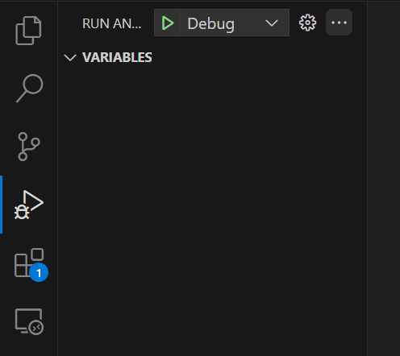

Now click on the green triangle to start debugging! The keyboard shortcut for this is `F5`.

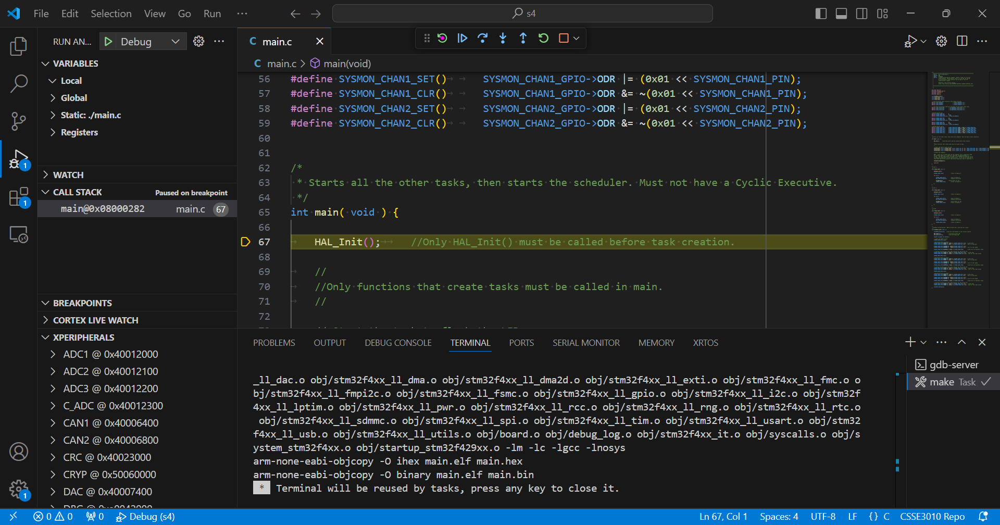

## Using Debugger
The debugger is configured to break at the first line of your `main` function. At this point, you should see a bar like this floating on top:

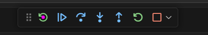

The options are (left to right):
- Reset - resets the microcontroller, like pressing the reset button.
- Continue - continues code execution, until the next breakpoint.
- Step Over - breaks at the next line, but do not go into function calls.
- Step Into - breaks at the next line, but do go into function calls.
- Step Out - breaks after returning from this function.
- Restart - compiles your program again and flash it onto the board, then breaks at main.
- Stop - stops the debugging session.

In the sidebar on the left, you have these sections:

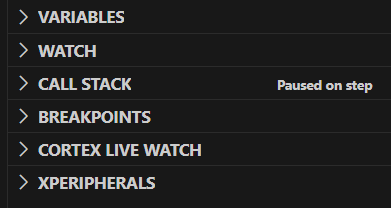

The useful ones are Variables, Call Stack, Breakpoints and xPeripherals. At the bottom, you have these tabs:


The useful ones are Memory and xRTOS.

### Variables
You can see local, global and static variables in the Variables window, as well as the processor registers:

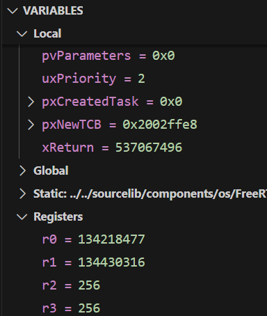

You can also modify the values of the variables and registers, just double click on them and change the value.

### Call Stack
The Call Stack window shows you the call stack of the currently running task and other tasks:

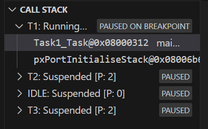

Basically, it shows you which function called your function and which function called that function and so on. You can click on different functions in the call stack to view their local variables. You can also see the call stack of other tasks.

### Breakpoints
The Breakpoints window shows you the current list of breakpoints, and you can enable/disable/delete them. New breakpoints can be created by clicking on the line number of the like you wish to break at.

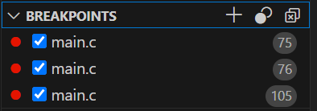

### xPeripherals
The xPeripherals window shows you the current state of all the I/O registers, and you can expand them out to see what bits are set and etc:

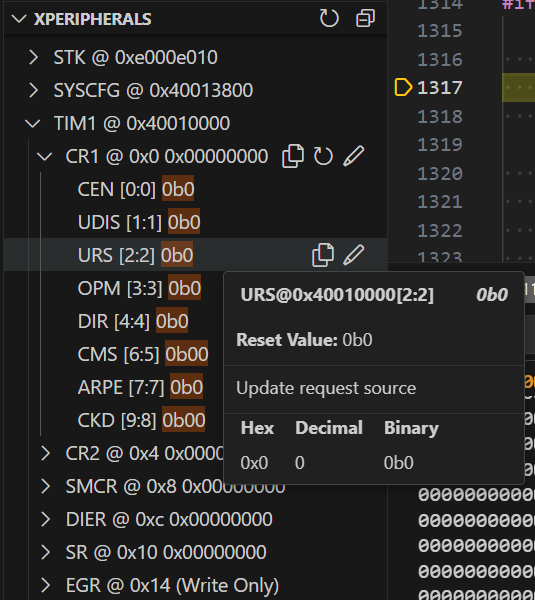

### Memory
The Memory tab on the bottom allows you to see hex dumps of the microcontroller's memory. It's useful if you have a pointer and see what it's pointing at.

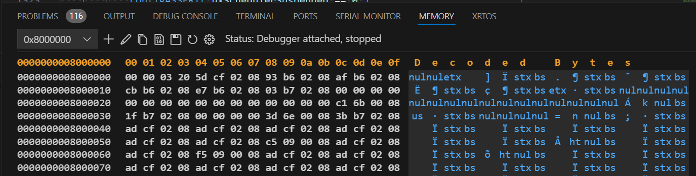

### xRTOS
The xRTOS tab shows you all the currently running tasks, as well as information regarding each task, like priority, state, location and stack usage:

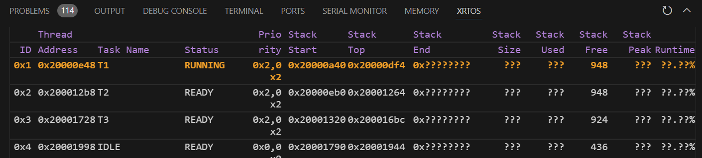

## Wrapping Up
Nothing much to say, good luck hunting down bugs. By the way, the code used in this guide is not my stage 4 code, it's the SYSMON example code in a folder named `s4` for demonstration purposes, so please don't report me.
