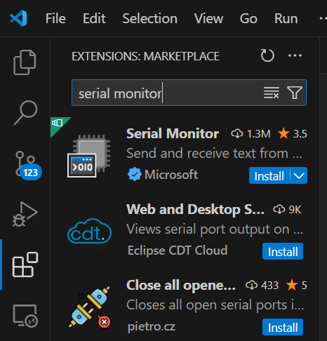

# Serial I/O - 21st Century Solution
It seems like we suffered the Y2K bug or our CMOS batteries died and we're now back to 1987, the year the UNIX `screen` command was invented! (Sorry for the bad joke.)

I have always found `screen` painful to use (ironic I know), and I prefer modern solutions (more irony), so here's a slightly more modern solution.

## Debug Prints
For people who want to debug their code by printing to terminal, I've got a demo here for you:

```c
#include <board.h>
#include <processor_hal.h>
#include <debug_log.h>
#include <stdbool.h>

bool HasInput(void)
{
    return BRD_DEBUG_UART->SR & USART_SR_RXNE;
}

char GetInputBlocking(void)
{
    while (!(BRD_DEBUG_UART->SR & USART_SR_RXNE))
    {
        ;
    }
	return (char)READ_REG(BRD_DEBUG_UART->DR);
}

int main(void)
{
    HAL_Init();
    BRD_debuguart_init();

    debug_log("Hello World!\r\n");
    debug_log("***ECHO-TEST***\r\n\r\n");

    while (1)
    {
        debug_putc(debug_getc());
    }

    return 0;
}
```

Essentially, you can use `debug_log` like `printf` (in fact, it's a clone of `printf`). You can also grab input characters using `debug_getc` and output characters to the terminal using `debug_putc`.

There's a catch with using `debug_getc` for getting input characters - if there's no character typed onto the terminal, it times out after 10ms and returns `0`. I've written a `GetInputBlocking` function that waits until a character is received. There's also a `HasInput` function for checking if there's an input character.

## Serial Monitor
`screen` is too advanced for people like me, so I prefer simplicity and Serial Monitor is not bad. The first thing you do when you want to use something is to install it. Serial Monitor is a VSCode extension, you install it from VSCode:



Once it's installed, you'll see it at the bottom:


What you want to do is click on this thing to toggle terminal mode:


Once it's in terminal mode, for the port, select the USB serial device for the Nucleo board.

### Windows
If you're on Windows, you can check which port it is using Device Manager:


It's always under Ports (COM & LPT). In my case, it's COM7. It may just say "USB Serial Device", if that's the case (probably will be), then it means you don't have the driver. It may still work without the driver, so give it a try. If it doesn't work, download the JLink software and install it, remember to tick Install legacy USB Driver for J-Link (requires admin rights).

### Linux
If you're on Linux (WSL included), it's a character device with a node under `/dev` like `/dev/ttyACM0`. If you have multiple ACM devices, then I've got a script that prints out which specific one it is:

```bash
#!/bin/bash
for dev in /dev/*; do
        [[ "$dev" == "/dev/stdin" || "$dev" == "/dev/stdout" || "$dev" == "/dev/stderr" ]] && continue
        if [ -c "$dev" ]; then
                if udevadm info "$dev" | grep -q "ID_VENDOR_ID=1366"; then
                        echo "$dev"
                fi
        fi
done
```

### macOS
I've never used macOS before, sorry.

Once you figure out what the device node is, click on the port dropdown in Serial Monitor and select it.


Now select the baud rate. It is 115200.


Then press Start Monitoring and it should just work. You may need to reset your board for text to come up.


## PuTTY
If you're on Windows and prefer not to use VSCode + Serial Monitor, PuTTY also works perfectly. Just click on "Serial", then enter in the COM port and set speed to 115200, and press Open.


Reset your board and text should come up:


> [!WARNING]
> You may face issues with new lines!<br><br>A new line on a classic terminal should be a carriage return (CR; move cursor to col 0) followed by a line feed (LF; move cursor one line down), however it's not always like that. Some terminals (Serial Monitor for example) recognises LF (\n) and knows that it's a new line, some don't and simulate dumb terminals or teletypes and only move your cursor down 1 row (you get staircase text).<br><br>To make all terminal emulators happy, personally I would use the CRLF sequence "\r\n" for new lines. I would also treat the CR ("\r") character as the new line character for inputs, or translate it to "\n" in code, because both PuTTY and Serial Monitor by default only sends CR when you press ENTER. PuTTY is configurable to have implicit CRs and LFs, Serial Monitor doesn't seem like it has that ability.
