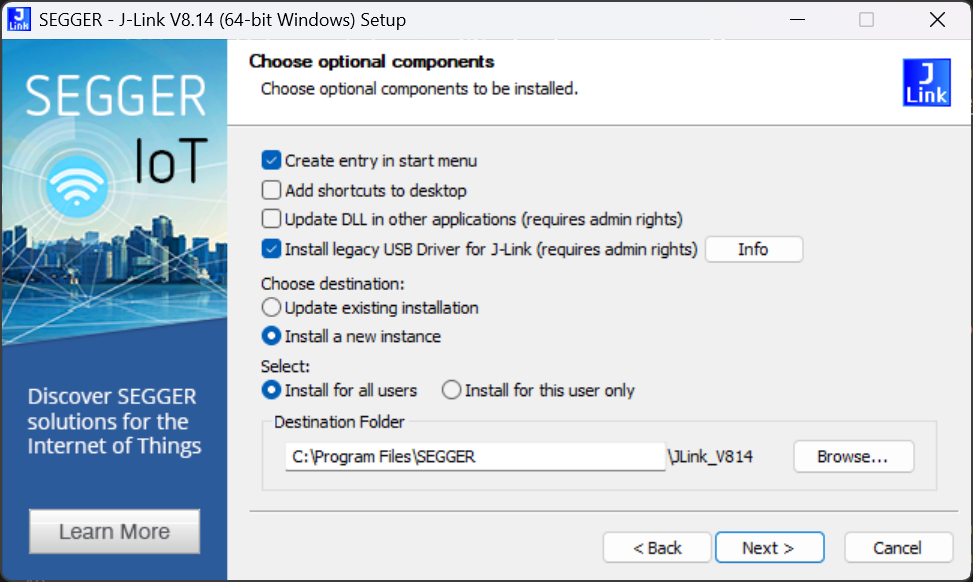
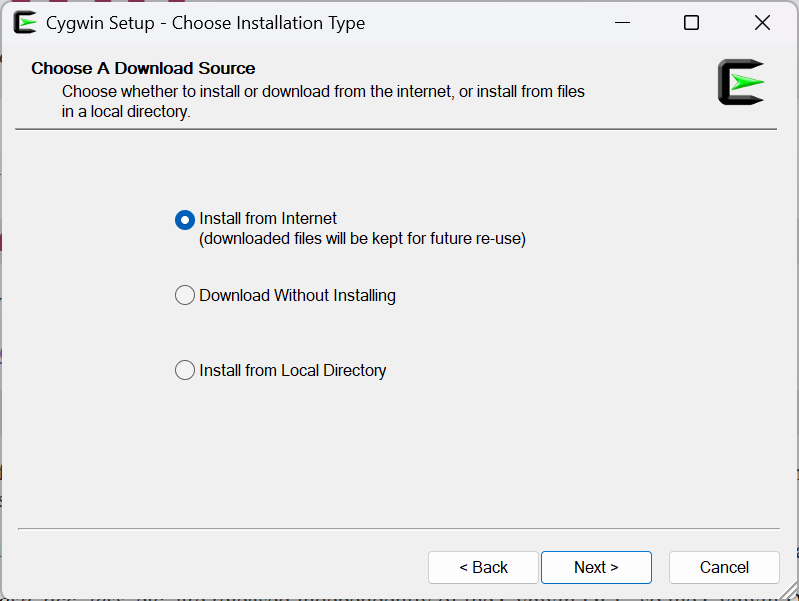
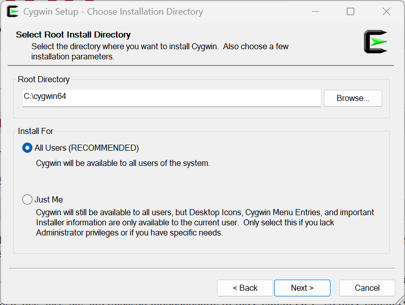
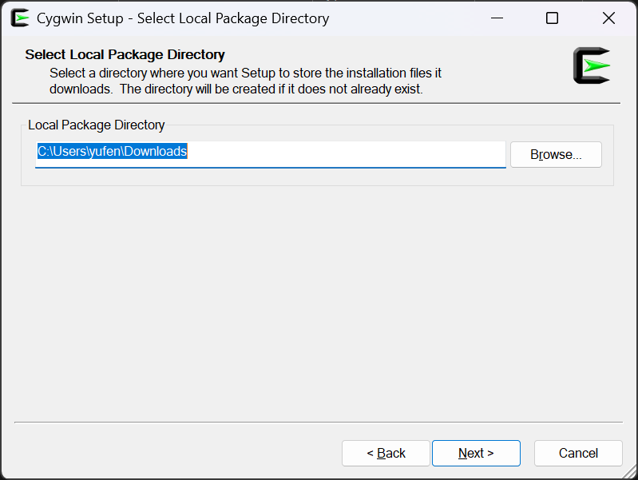
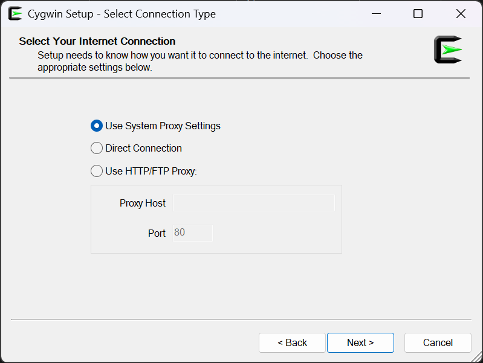
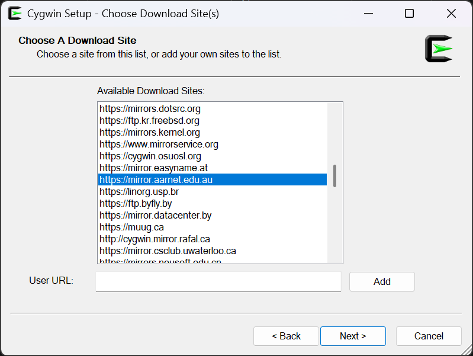
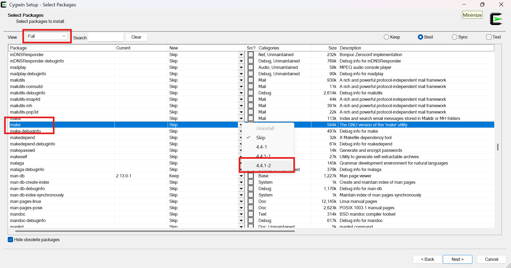
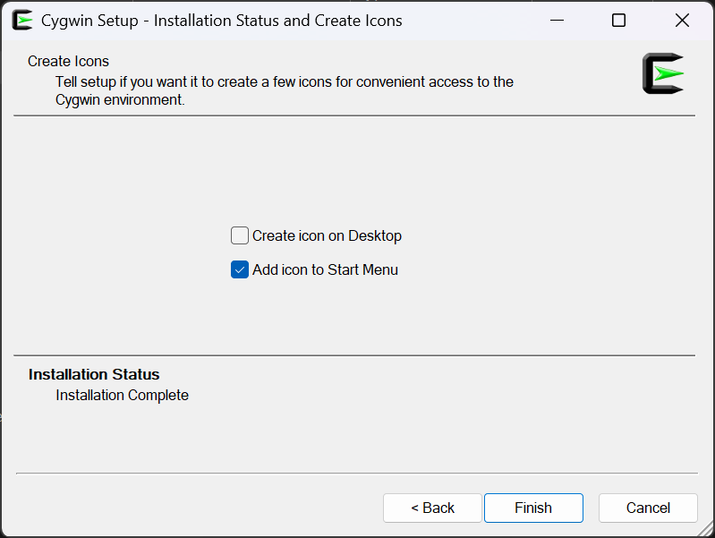
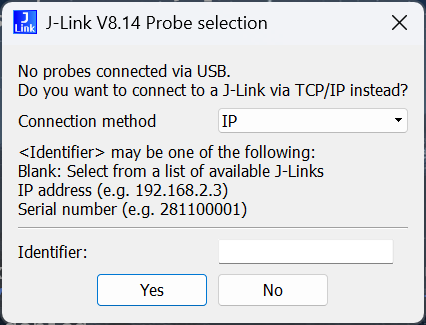

# Development on Windows without WSL
> [!IMPORTANT]
> This is an unofficial guide for doing development work on Windows without WSL. It is not endorsed nor supported by course staff, and I am not responsible for any damage caused by following this unofficial guide.

> [!IMPORTANT]
> Currently, this guide only works for x86-64/AMD64 Windows PCs. While you may follow this guide if you are using an ARM64 Windows PC, the last step (flashing code onto your board) will not work due to the lack of ARM64 drivers (see [ARM64 Technical Details](#arm64-technical-details)). If you are using an ARM64 Windows device, you may try my unofficial [ARM64 guide](ARM64.md).

## Required Software
- Git
- Python

## Setting Up Environment
For development on native Windows, we'll store our files under `%userprofile%\Documents\csse3010`, for example, in my case, `C:\Users\yufen\Documents\csse3010`.

```
cd %userprofile%\Documents
md csse3010
cd csse3010
```

Under the `csse3010` folder, we'll clone <u>sourcelib</u> and <u>repo</u>.

> [!IMPORTANT]
> sourcelib is the repository hosted on GitHub. repo is your repository hosted on UQ's server at https://csse3010-gitea.uqcloud.net/XXXXXXXX/repo, and the repository which you will be committing your code to. They are NOT the same.

### sourcelib
Cloning sourcelib does not require VPN, as it's stored on GitHub. You can do this by running the command:

```
git clone https://github.com/TheBrokenPipe/sourcelib.git
```

> [!IMPORTANT]
> Note that this is my PERSONAL repo, NOT the official one. This repo has some modifications done to enable sourcelib to work under Microsoft Windows. This repo is NOT endorsed by course staff and I nor any course staff will be responsible for ANY damage caused by using this repo or following this UNOFFICIAL guide.

### repo
Cloning repo <u>does</u> require VPN. You may either turn on UQ VPN, or follow my [no-VPN guide](./RepoNoVPN.md) to clone the repo without VPN. Replace `XXXXXXXX` with your student number.

```
git clone git@csse3010-gitea.zones.eait.uq.edu.au:XXXXXXXX/repo.git
```

# Installing sourcelib
Run `sourcelib_windows.bat` in `%userprofile%\Documents\csse3010\sourcelib\tools`.

## Installing the Programmer - JLink
Download JLink from here ([x86-64](https://mega.nz/file/EdZmHTyS#60ndQFdQnf8LBRm7WcyBqtzGus-ItWiQnX2sU5wUWiM), [ARM64](https://mega.nz/file/kIJ33JoC#HM9tMv5blU64hi9dMpTT2WhKafaDlUH7FF-R4Hte0c8)). Pick the right one to download based on your architecture, and install it.

When installing, <u>make sure you select "Install legacy USB Driver for J-Link (requires admin rights)"</u>. You might also want to unselect "Update DLL in other applications (requires admin rights)".



## Installing the Compiler
Download and install the compiler from [here](https://mega.nz/file/FUJFWSIB#fcQ2mwgArtKu_k5IqhOVizI4WNOABLwbS-oiffeKctI). Use default settings for everything.

## Installing GNU Make and Co.
You'll need Cygwin in order to run the classic UNIX tools like `make` and `rm`. Download and installed it here - https://www.cygwin.com.

When prompted for download source, select "Install from Internet":



When prompted for root install directory, make sure you keep the default (`C:\cygwin64`):



When prompted for local package directory, just use the whatever default you see and press next:



When prompted for internet connection, continue with the default:



When prompted for download site, pick any but here I've chosen one hosted in Australia:



Next comes the important bit - when selecting packages, choose the "full" view, then scroll to the package named "make", click on the drop down button and select the latest version:



Finally, choose whether or not to create a desktop and/or start menu shortcut. I personally prefer to create a start menu shortcut but no desktop shortcut:



## Compiling Code
Now, just run `env.bat` in `%userprofile%\Documents\csse3010` and you'll get a terminal environment which allows you to compile and flash code. I have not tried to get VSCode to work yet, but that's on the todo list.

### Blinking LEDs
Once you run `env.bat`, go to the directory where the source code is stored:

```
cd %userprofile%\Documents\csse3010\sourcelib\examples\getting-started\blink\nucleo-f429
```

Then to compile the code, run `make`. You'll probably see errors like:

```
main.c:11:10: fatal error: board.h: No such file or directory
   11 | #include "board.h"
      |          ^~~~~~~~~
compilation terminated.
Makefile:33: .depend: No such file or directory
make: *** [C:\Users\yufen\Documents\csse3010\sourcelib/components/mk/m_common.mk:23: .depend] Error 1
```

This is due to the use of double quotes for including library headers. Technically, the code is correct, but there's something going on here and it does not search for the library includes when double quotes are used. Just open the file up and replace the double quotes with angled brackets <> in those library #includes and run make again.

It'll produce a lot of text and should end with something like:

```
arm-none-eabi-objcopy -O ihex main.elf main.hex
arm-none-eabi-objcopy -O binary main.elf main.bin
```

Yup, you have successfully compiled your first piece of code for this course.

## Flashing Your Code
Ideally, run `make flash` and the code should be flashed onto the board, like so:

```
C:\Users\yufen\Documents\csse3010\sourcelib\examples\getting-started\blink\nucleo-f429>make flash
python C:\Users\yufen\Documents\csse3010\sourcelib/tools/programming/myflash.py
SEGGER J-Link Commander V8.14 (Compiled Feb 21 2025 15:53:21)
DLL version V8.14, compiled Feb 21 2025 15:52:27

Connecting to J-Link via USB...O.K.
Firmware: J-Link STLink V21 compiled Aug 12 2019 10:29:20
Hardware version: V1.00
J-Link uptime (since boot): N/A (Not supported by this model)
S/N: 773890340
VTref=3.300V


Type "connect" to establish a target connection, '?' for help
J-Link>Target connection not established yet but required for command.
Device "STM32F429ZI" selected.


Connecting to target via SWD
InitTarget() start
SWD selected. Executing JTAG -> SWD switching sequence.
DAP initialized successfully.
InitTarget() end - Took 10.8ms
Found SW-DP with ID 0x4BA01477
DPv0 detected
CoreSight SoC-400 or earlier
Scanning AP map to find all available APs
AP[1]: Stopped AP scan as end of AP map has been reached
AP[0]: AHB-AP (IDR: 0x24770011, ADDR: 0x00000000)
Iterating through AP map to find AHB-AP to use
AP[0]: Core found
AP[0]: AHB-AP ROM base: 0xE00FF000
CPUID register: 0x410FC241. Implementer code: 0x41 (ARM)
Found Cortex-M4 r0p1, Little endian.
FPUnit: 6 code (BP) slots and 2 literal slots
CoreSight components:
ROMTbl[0] @ E00FF000
[0][0]: E000E000 CID B105E00D PID 000BB00C SCS-M7
[0][1]: E0001000 CID B105E00D PID 003BB002 DWT
[0][2]: E0002000 CID B105E00D PID 002BB003 FPB
[0][3]: E0000000 CID B105E00D PID 003BB001 ITM
[0][4]: E0040000 CID B105900D PID 000BB9A1 TPIU
[0][5]: E0041000 CID B105900D PID 000BB925 ETM
Memory zones:
  Zone: "Default" Description: Default access mode
Cortex-M4 identified.
Reset delay: 0 ms
Reset type: NORMAL (https://wiki.segger.com/J-Link_Reset_Strategies)
Reset: Halt core after reset via DEMCR.VC_CORERESET.
Reset: Reset device via AIRCR.SYSRESETREQ.
J-Link>PC = 0803D0AC, CycleCnt = 00000000
R0 = 00000000, R1 = 00000000, R2 = 00000000, R3 = 00000000
R4 = 00000000, R5 = 00000000, R6 = 00000000, R7 = 00000000
R8 = 00000000, R9 = 00000000, R10= 00000000, R11= 00000000
R12= 00000000
SP(R13)= 20030000, MSP= 20030000, PSP= 00000000, R14(LR) = FFFFFFFF
XPSR = 01000000: APSR = nzcvq, EPSR = 01000000, IPSR = 000 (NoException)
CFBP = 00000000, CONTROL = 00, FAULTMASK = 00, BASEPRI = 00, PRIMASK = 00

FPS0 = 00000000, FPS1 = 00000000, FPS2 = 00000000, FPS3 = 00000000
FPS4 = 00000000, FPS5 = 00000000, FPS6 = 00000000, FPS7 = 00000000
FPS8 = 00000000, FPS9 = 00000000, FPS10= 00000000, FPS11= 00000000
FPS12= 00000000, FPS13= 00000000, FPS14= 00000000, FPS15= 00000000
FPS16= 00000000, FPS17= 00000000, FPS18= 00000000, FPS19= 00000000
FPS20= 00000000, FPS21= 00000000, FPS22= 00000000, FPS23= 00000000
FPS24= 00000000, FPS25= 00000000, FPS26= 00000000, FPS27= 00000000
FPS28= 00000000, FPS29= 00000000, FPS30= 00000000, FPS31= 00000000
FPSCR= 00000000
J-Link>'loadfile': Performing implicit reset & halt of MCU.
Reset type: NORMAL (https://wiki.segger.com/J-Link_Reset_Strategies)
Reset: Halt core after reset via DEMCR.VC_CORERESET.
Reset: Reset device via AIRCR.SYSRESETREQ.
Downloading file [main.hex]...
J-Link: Flash download: Bank 0 @ 0x08000000: 3 ranges affected (262144 bytes)
J-Link: Flash download: Total: 6.455s (Prepare: 0.126s, Compare: 0.124s, Erase: 4.726s, Program & Verify: 1.415s, Restore: 0.063s)
J-Link: Flash download: Program & Verify speed: 181 KB/s
O.K.
J-Link>Device "STM32F429ZI" selected.


Connecting to target via SWD
InitTarget() start
SWD selected. Executing JTAG -> SWD switching sequence.
DAP initialized successfully.
InitTarget() end - Took 12.1ms
Found SW-DP with ID 0x4BA01477
DPv0 detected
CoreSight SoC-400 or earlier
AP map detection skipped. Manually configured AP map found.
AP[0]: AHB-AP (IDR: Not set, ADDR: 0x00000000)
AP[0]: Core found
AP[0]: AHB-AP ROM base: 0xE00FF000
CPUID register: 0x410FC241. Implementer code: 0x41 (ARM)
Found Cortex-M4 r0p1, Little endian.
FPUnit: 6 code (BP) slots and 2 literal slots
CoreSight components:
ROMTbl[0] @ E00FF000
[0][0]: E000E000 CID B105E00D PID 000BB00C SCS-M7
[0][1]: E0001000 CID B105E00D PID 003BB002 DWT
[0][2]: E0002000 CID B105E00D PID 002BB003 FPB
[0][3]: E0000000 CID B105E00D PID 003BB001 ITM
[0][4]: E0040000 CID B105900D PID 000BB9A1 TPIU
[0][5]: E0041000 CID B105900D PID 000BB925 ETM
Memory zones:
  Zone: "Default" Description: Default access mode
Cortex-M4 identified.
J-Link>OnDisconnectTarget() start
OnDisconnectTarget() end - Took 1.12ms
```

If anything pops up asking you to agree to some terms and conditions, just agree. If anything else happens, it may require closer inspection (see [Troubleshooting](#troubleshooting)). If you are using an ARM64 device, flashing will NOT work.

## Limitations
This is literally something I put together in an hour for the sake of getting something to work, so don't expect too many things to work. For now, there's no VSCode and no serial I/O.

## Troubleshooting
### Failing to Flash Code
If you encounter a prompt like this when flashing your code:



... then it means J-Link couldn't connect to the device. Possible causes:
- Device not connected.
  - Check to see if you have plugged your board in properly.
- Device already in use.
  - If you have already shared the connection with WSL via usbipd, then you may need to unplug and replug your board.
- J-Link driver not installed.
  - This is the most common cause of the issue.
  - If you are on Intel x86 (not ARM64), go to `C:\Program Files\SEGGER\JLink_V814\USBDriver` and double click on `InstDrivers.exe`. This would install the drivers which you'll need in order for your computer to recognise the programmer.
  - If you are on ARM64, unfortunately there is not much you can do to solve this issue.

## ARM64 Technical Details
### J-Link Drivers
Everything works on ARM64, until the step where you flash your code. This is because J-Link only supports WinUSB on ARM64, and therefore is missing the drivers (namely "J-Link" and "J-Link CDC") needed by SEGGER. The "J-Link" driver is required for flashing the code, and the "J-Link CDC" driver is probably required for serial I/O (though Windows' generic serial device driver may also work).

These drivers exist for x86-64 and x86-32, but not ARM. Drivers are a bit special as they run in kernel mode and may make use of hardware/platform-dependent code, so while they may install correctly, they are not emulated.

### usbipd
usbipd fails to work as the result of the service not running. The service fails to run as the result of missing the "VirtualBox USB" and "VirtualBox USB Monitor" drivers. By default, the x86-64 versions of these drivers are installed along with usbipd, and as mentioned earlier, they are not emulated and therefore causes usbipd's service to fail somewhat silently.

The latest development snapshot of VirtualBox includes the ARM64 versions of these drivers, however experiment (sample size = 1) suggests that they do not install properly due to signature-related issues. Windows enforces signature verification on device drivers for security purposes, and therefore drivers with signature issues cannot be installed/loaded.

Check out [this page](./ARM64.md) for a potential workaround.